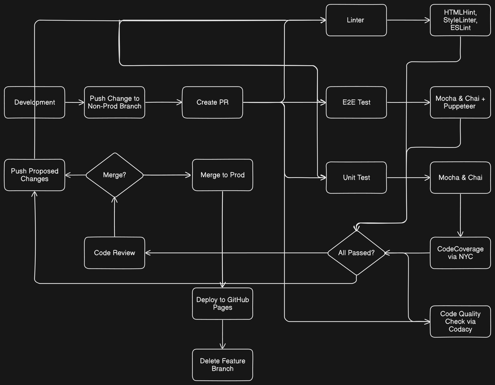

# CI & CD Pipeline

## Pipeline

### Linter
We decided to use following tools to properly implement linting for our project codebase:
1. HTML Linter
2. Style Linter
3. ESLinter

Linting is a necessary tool to make all team members enforce code conventions in order to maintain a clean and readable code for everyone in the team. This also increases the bus factor lol.

Whenever a Pull Request is being made, the integration pipeline will run through each linter checks and fail if any is unsuccessful. The team members will be notified as well so they can make changes ASAP.

### Code Quality
We decided to use Codacy to enforce code quality. It flags low-quality code through static code analysis while also providing a comprehensive report next to other pipeline steps so team members can check the quality report right away, and also see what section is making Codacy fail the quality check.

### Code Security Vulnerability Prevention
We decided to use CodeQL to enforce, notify, and suggest potential code vulnerability. Although it is not integrated in each pipeline step since it has direct integration with GitHub repositories, it will actively scan the codebase and immediately report any possible vulnerability and security issues that may arise from our codebase.

### Unit Tests & E2E Tests
We decided to use Mocha for unit testing framework and Chai for assertion framework. Mocha & Chai are simple, intuitive yet comprehensive and efficient (faster than Jest) framework to perform testing.

We decided to keep Mocha and Chai, then add Puppeteer for E2E testing. For now, we can use a headless version of Puppeteer and it can be manually turned on by team members locally if they want to do a more exhaustive review of how their changes want to be tested. Nonetheless, headless Puppeteer drastically increases the E2E testing speed and for the purpose of our project (a client side website) we don't expect headless bringing any issues for any aspect of our project.

### Test Coverage
We decided to use NYC to enforce test coverage. It is almost impossible to cover every single line of our code with a respective test. However, a vast majority of our code should be covered. In this way we have set the test coverage requirement to be 90% - if a team member pushes changes and the coverage falls under 90% then it simply won't pass the pipeline until they add more tests. This has been demonstrated in the video.
Locally, team members can run `pnpm run coverage` to see a simple coverage report, so they don't have to rely on the integration pipeline to check their change's coverage information.

### Human Review
Leaders are responsible for reviewing changes after all automation tests pass. Reviewers will give feedback and request changes directly in the Pull Request and team members are expected to make changes, then push to the same branch, let automation tests run again (this happens automatically), then request review from leaders again.

### Deployment
As of now, the entire application can be run on GitHub pages so we are relying on that for our production deployment. If anything changes (such as expanded scope) then we will look for other potential hostings such as Vercel.

## Future Phases

### Documentation
As of now, the documentation generation has not yet been implemented. We believe JSDocs is okay but there should be a better alternative for documentation generation.

### Packaging
Sadly, due to the constraints (professor and TA) we are not allowed to use bundler or transpiler **as of now (check when this file has been edited)**. We would love to see these things being allowed to improve codebase quality and numerous quality of life improvements.

## Diagram
