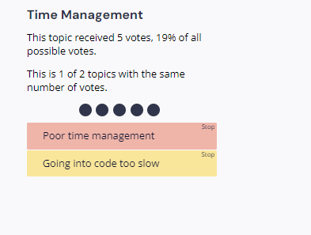
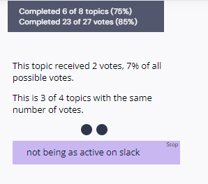

# CSE 110 Team 35 Meeting #3 - Sprint Review & Retrospective

## Overview
- **Team Number**: 35
- **Meeting Type**: Regularly Scheduled
- **Location**: Online
- **Objective**: Complete the retros for warmup exercise
- **Time**: 2:00 PM - 2:30 PM, April 28, 2024

## Attendance

### Leader
- [X] Allen Zhang
- [X] Shota Yasuraoka

### Member
- [X] Andrew Tan
- [X] Anny Zhao
- [X] Audrey Liang
- [X] Ethan Lee
- [ ] Ivor Myers
- [X] Jonathan Zhang
- [X] Mitchell Bizzigotti
- [X] Tyler Khuc
- [X] Vincent McCloskey

### Absences
Ivor

## Agenda

### Unfinished Business from Last Meeting
None

### New Business to Cover
- [X] Fill the team review form
- [X] Retrospective

## Decisions
- Retrospective
  - What went well
    - Use LiveShare when working as a group
    - In-person meetings for designers to talk about what each other is thinking more easily
    - Dividing workload
    - Code Review
  - What did not go well
    - Not enough time to polish Task List part

### Retro Steps
#### Activity 1

Everyone did an anonymous evaluation of this warmup exercise in terms of Clarity, Engagement, Autonomy, Mastery, Meaning, and Impact

Result:
- 4.0/5.0 in most categories and 3.0/5.0 in one category - everyone seems to be happy about their role and workload
- Lowest in mastery implies we have yet to grasp enough knowledge to perform well in web development

#### Activity 2

Everyone grouped the start, stop, and continue list notes and voted on importance

Result:
- Clarity is the most important point, leaders should be defining and splitting tasks in a more specific manner.
- Time management is almost as important as clarify, leaders should be more responsible in reminding everyone about their progress and do more frequent follow ups
- Turns out we spent too much time proposing and designing for a very simple project, it's better to get hands-on programming earlier.
- Collaboration between designer and programmer (at least in terms of this project) is very important, everyone agrees that designers need to know what's possible and not possible and programmers need to be well aware of what do designers have in mind since diagramming can't 100% convey that.
