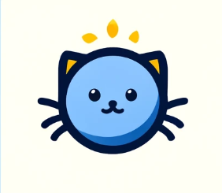
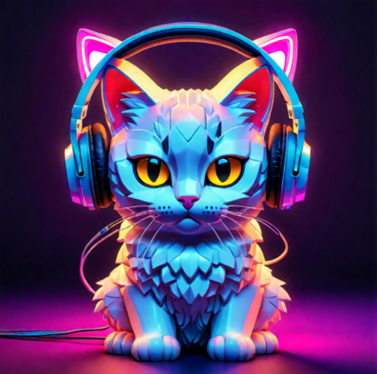

# Team Information
- Number: 35
- Name: Coding Kittens

## Logo

## Mascot

## Font
[Jetbrains Mono](https://fonts.google.com/specimen/JetBrains+Mono)

# Team Members

## Leaders
Allen
- https://github.com/nadecancode
- 2nd year Data Science major
- I like coding and playing video games.
- Fun fact: I’m Chinese but I like Japan a lot.

Shota
- https://github.com/ShotaYasuraoka
- 2nd year CE major
- I like watching baseball games
- Fun fact: I’m Japanese but I don’t like sushi.

## Members
Audrey
- https://github.com/oodball
- 3rd year CogSci Machine Learning major, minoring in CS
- I read webtoons/manga and I really like finding new music!
- Fun fact: Bread loves going moldy specifically when I buy it

Anny
- https://github.com/ayynny
- 3rd year CS major
- I enjoy lifting, playing pickleball, and reading manga/webtoons
- Fun fact: i’ve collected so many plushies that i dedicated bookshelf to it

Vincent
- https://github.com/vinmoemac
- 2nd year CS major
- I love kicking back watching tv and playing video games
- Fun fact: Me and my roommate have a foot and a half height difference.

Andrew
- https://github.com/Ant044
- 3rd year CS major
- I play video games and watch anime.
- Fun fact: I used to make Minecraft animations

Mitchell
- https://github.com/mbizzigotti
- 3rd year CS major
- I enjoy coding in C/C++ and riding my bike.
- Fun Fact: I have lived in the San Diego area my whole life.

Jonathan
- https://github.com/jxnxthxnz
- 2nd yr CS major
- I’m a huge foodie and I love traveling.
- Fun fact: I absolutely love Costco, and I’m known as the glizzy goblin in the food courts.

Ivor
- https://github.com/ivormyers
- 3rd Year CS Major with a minor in finance
- I love to play volleyball and ski. I enjoy mixing and seeing live music.
- Fun Fact: My record shotgun time was 2.8 seconds.

Tyler
- https://github.com/tylercooksrice
- 3rd Year CS major
- I love eating kbbq and traveling
- Fun Fact: The most rounds I have eaten with my friends is eight rounds.
